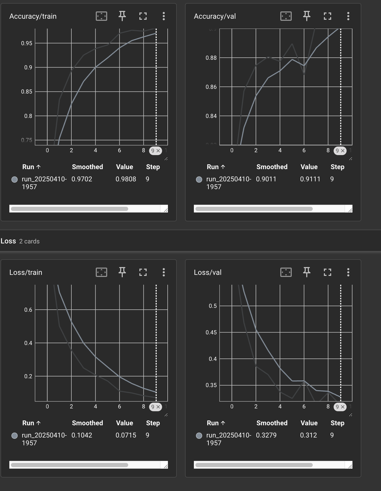
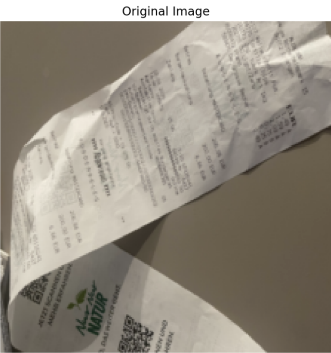

# Trash Classifier with Explainability

A deep learning project to classify recyclable waste items from images, enhanced with visual explainability tools. This pipeline includes model training, evaluation, and a real-time interactive app to demonstrate classification and model interpretation.

---

## Purpose and Why This Project Matters

Recycling is a crucial step toward sustainability, but it remains a manual and error-prone process. Automating trash classification helps:
- Improve waste sorting accuracy
- Reduce contamination in recycling streams
- Enable smart waste management systems

This project builds a lightweight yet powerful image classifier that recognizes 6 categories of recyclable and non-recyclable waste, enhanced with saliency-based interpretability to show *why* the model predicts what it does.

---

## Architecture Overview

- **Backbone Model**: MobileNetV2 (pretrained on ImageNet)
- **Classifier Head**: Fully connected layer with 6 output classes
- **Explainability**: Captum's Saliency, SmoothGrad, Guided Backpropagation
- **Deployment**: Streamlit app for real-time prediction and visualization


## Dataset Used

- **Name**: [TrashNet](https://github.com/garythung/trashnet)
- **Classes**: cardboard, glass, metal, paper, plastic, trash
- **Image Size**: 512x384 pixels
- **Class Distribution**:
  - Paper: 23.51%
  - Glass: 19.83%
  - Plastic: 19.07%
  - Metal: 16.22%
  - Cardboard: 15.95%
  - Trash: 5.42%
- **Handling**: Dataset split into `train`, `val`, `test` folders with stratification

---

## Techniques and Tools Used

- **Model Training**:
  - Transfer learning with frozen base layers
  - Adam optimizer, CrossEntropyLoss
  - TensorBoard for live metric tracking

- **Preprocessing**:
  - Resize & normalize images to 224x224
  - Stratified train-val-test split

- **Explainability**:
  - Captum's:
    - `Saliency`: Base gradients
    - `SmoothGrad`: Smoothed attribution
    - `GuidedBackprop`: Edge-focused explanations
  - Visualization: Matplotlib side-by-side comparisons

- **Deployment**:
  - Streamlit app with file uploader and toggle for saliency types

---

## Training Procedure

- Epochs: 10
- Optimizer: Adam (lr = 1e-4)
- Loss Function: CrossEntropy
- Early Stopping: Not needed (no overfitting)
- Logging: TensorBoard for accuracy/loss

Training monitored using:
- `Accuracy/train` and `Accuracy/val`
- `Loss/train` and `Loss/val`

**Training Accuracy/Validation Graph:**


  

---

## Result Evaluation

| Metric          | Value    |
|----------------|----------|
| Train Accuracy  | 98.1%    |
| Val Accuracy    | 91.1%    |
| Train Loss      | 0.071    |
| Val Loss        | 0.312    |

**Evaluation Tools**:
- TensorBoard visualization
- Saliency-based interpretation (SmoothGrad + Guided)
- Streamlit demo UI

**Visual Placeholder:**

<table>
  <tr>
    <td></td>
    <td></td>
  </tr>
</table>
---

## Overall Project Impact

- Demonstrates real-world machine learning application  
- High performance on imbalanced, noisy data  
- Includes interpretability and explainability tools  
- Easy-to-use UI for non-technical users  

This project shows a complete ML pipeline — from raw image data to deployed app with transparency in decision-making.

---

## Final Result

> A robust trash classifier trained on real data, achieving **91.1% accuracy** on validation and equipped with **visual explainability**, ready to be deployed in sustainability-focused applications, smart bins, or recycling plants.

**[Live Demo Link Coming Soon]**

**[Try Locally]**:  
```bash
streamlit run web_app/app.py
```

---
